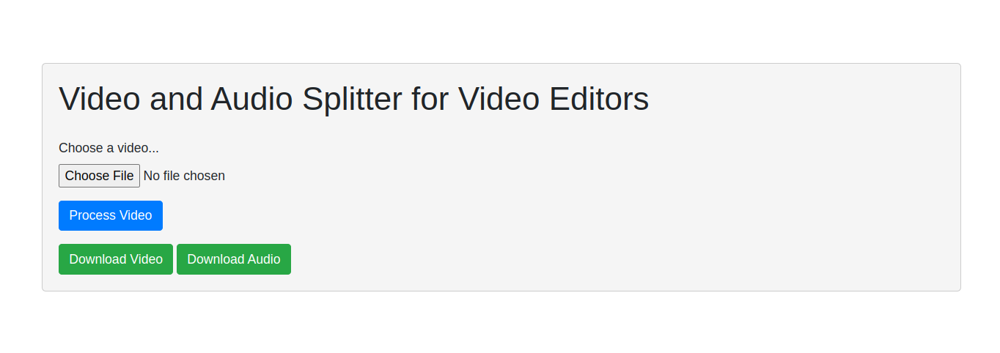

Functionality:
File Upload:

Users can upload a video file in the .mp4 format using a file input form.
The application checks if a file has been selected; otherwise, it displays an error message.
Video Processing:

Upon file upload, the program extracts the audio from the video using the MoviePy library.
The audio is further processed using PyDub, where it is split into chunks based on silence.
These chunks are then recombined into a single audio segment to remove silence gaps.
Downloadable Outputs:

The processed audio and the original video without audio are saved and made available for download.
Users can download the combined audio as a .wav file and the processed video as an .mp4 file.
User Interface:

The web interface is built using HTML and Bootstrap, providing a clean and user-friendly design.
Users receive feedback messages, such as errors or successful processing, displayed on the interface.
Usage:
Upload Video:

Users visit the web application and select a video file using the provided form.
Process Video:

Upon submission, the program processes the uploaded video, extracts audio, removes silence, and generates downloadable audio and video files.
Download Output:

Users are presented with buttons to download the processed audio and video files.
Additional Notes:
The program employs Flask to handle the server-side logic, providing a responsive and interactive user experience.
The use of libraries such as MoviePy and PyDub enhances the functionality of the program by simplifying video and audio processing tasks.
The application helps video editors by providing a convenient tool for splitting and processing audio, which can be particularly useful in scenarios where removing silence is desired.
Overall, this program offers a straightforward solution for users looking to split and process audio from video files, enhancing the flexibility and usability of multimedia content for video editing purposes.

#huggingface link  
https://huggingface.co/spaces/razaAhmed/VideoandAudioSplitter